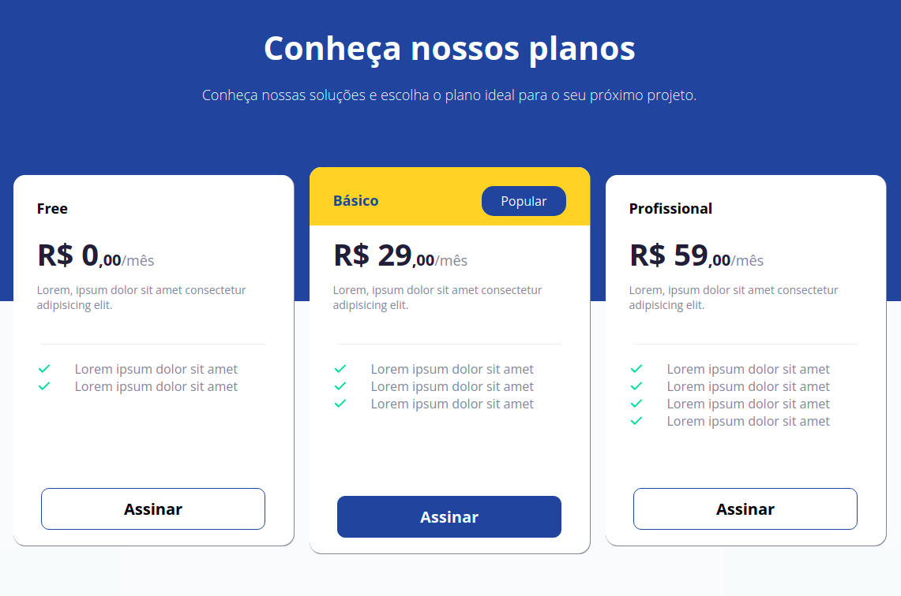

# Princing-Table

## 💻 **Tecnologias**

Esse projeto foi desenvolvido com essas tecnologias:

- [HTML](https://developer.mozilla.org/pt-BR/docs/Web/HTML)
- [CSS](https://developer.mozilla.org/pt-BR/docs/Web/CSS)

## 🎨 **Layout**

Você pode visualizar o layout básico do projeto através desse [link](<https://www.figma.com/file/k1GEZb1iTXsedoote1GfWF/DD-%2F-Pricing-Table-(Copy)?node-id=203%3A68>)

## 🚀 **Projeto**

O projeto foi desenvolvido durante o curso Discover ​da Rocketseat.

E esse projeto pretende aprimora os conhecimentos adquirido no Discover Fundamentar.

- [O guia estelar de HTML](https://app.rocketseat.com.br/node/o-guia-estelar-de-html)
- [O guia estelar de CSS](https://app.rocketseat.com.br/node/o-guia-estelar-de-css)
- [Posicionando foguetes](https://app.rocketseat.com.br/node/posicionando-foguetes)
- [Formulários de outro planeta](https://app.rocketseat.com.br/node/formularios-de-outro-planeta)
- [Alinhando os planetas](https://app.rocketseat.com.br/node/flexbox)
- [App bonito, até nos textos](https://app.rocketseat.com.br/node/flexbox)

## :ringed_planet: **Desafio**

### Sobre o desafio:

- Neste desafio devemos construir uma página para mostrar as opções de planos disponíveis para assinatura.

### Requisito para o desafio:

- Seguir o layout do Figma.
- Deixando o Layout responsivo.
